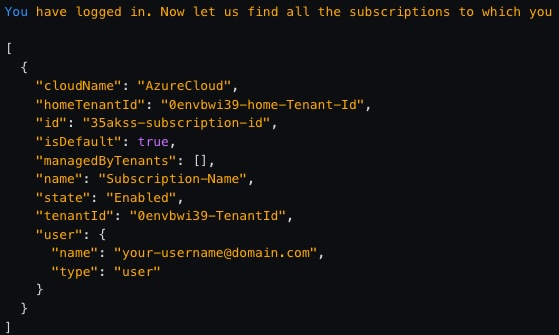
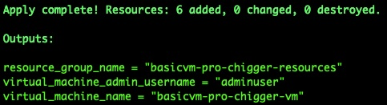
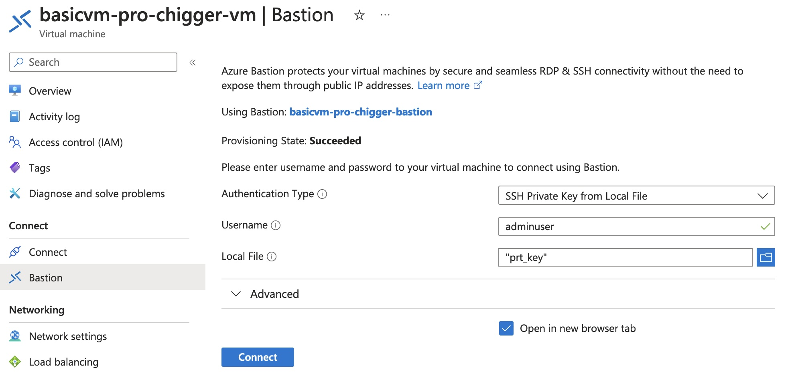

# demo-azure-linux-vm-terraform

## Prerequisites

* [Terraform](https://developer.hashicorp.com/terraform/install) is installed
* [Azure CLI](https://learn.microsoft.com/en-us/cli/azure/install-azure-cli) is installed
* A valid Azure subscription.
    - [Get a free one](https://azure.microsoft.com/en-us/free/).
    - [Pay as you go](https://azure.microsoft.com/en-us/pricing/purchase-options/pay-as-you-go).

## Let's run it

:bell: **Notice:** Don't change any `*.tfstate.*` files manually during the whole process. 
They are managed by Terraform automatically.

### 1. Setup Azure authentication

```shell
az login
```

If you have successfully logged in, you'll see output like this:



Write down the `id` (subscription id) and `tenantId` here, you'll need them later. If you don't see or have missed the above output for some reason, you can try this command to recall it (a successful login is still required):

```shell
az account list
```

Once you've got your subscription id and tenant id, carry on with the following steps:

```shell
# set current active subscription
az account set --subscription "<SUBSCRIPTION_ID>"
```

```shell
# create a service principal
az ad sp create-for-rbac --role="Contributor" --scopes="/subscriptions/<SUBSCRIPTION_ID>"
```

Write down the `appId` and `password` in the output. Now set some necessary environment variables.

For shell:

```shell
export ARM_CLIENT_ID="<APPID_VALUE>"
export ARM_CLIENT_SECRET="<PASSWORD_VALUE>"
export ARM_SUBSCRIPTION_ID="<SUBSCRIPTION_ID>"
export ARM_TENANT_ID="<TENANT_ID>"

# check it
printenv | grep ^ARM*
```

For PowerShell:

```powershell
$Env:ARM_CLIENT_ID = "<APPID_VALUE>"
$Env:ARM_CLIENT_SECRET = "<PASSWORD_VALUE>"
$Env:ARM_SUBSCRIPTION_ID = "<SUBSCRIPTION_ID>"
$Env:ARM_TENANT_ID = "<TENANT_ID>"

# check it
gci env:ARM_*
```

### 2. Generate a pair of SSH keys for login to VM later

For PoC (Proof of Concept) test purposes, note 2 things:
- When it prompts `Enter file in which to save the key`, better to give a specific path other than the default one, so that you will not override your default key files.
- When it prompts `Enter passphrase`, you can press Enter directly to skip it, so it will make the test easier.

```shell
ssh-keygen -t rsa
```

Put the generated public key file to this project folder (the Terraform scripts would try to find it by name of `key.pub`), and save the private key file for later use.

### 3. Run Terraform to create a basic Linux VM without Bastion

```shell
terraform init

# optional:
terraform plan

terraform apply
```

If the last command `terraform apply` succeeds, you should be able to see a group of resources are generated like this:



Explore anything on Azure portal if you would like to. Please note that there's no way for you to login this VM at this moment without further configuration changes.

### 4. Run Terraform again to add Bastion

```shell
# This step was a bit slow according to my test (~8 mins). Please keep patient.
terraform apply -var='create_bastion=true'
```

Now you can login the VM via Bastion referring this [guide](https://learn.microsoft.com/en-us/azure/bastion/bastion-connect-vm-ssh-linux). Select "SSH private key from local file", input the private key generated earlier.



### 5. Destroy everything you've just created
```shell
terraform destroy
```

## Relevant repositories

* [will8ug/basic-linux-vm](https://github.com/will8ug/basic-linux-vm)

* [will8ug/demo-azure-aks-terraform](https://github.com/will8ug/demo-azure-aks-terraform)
